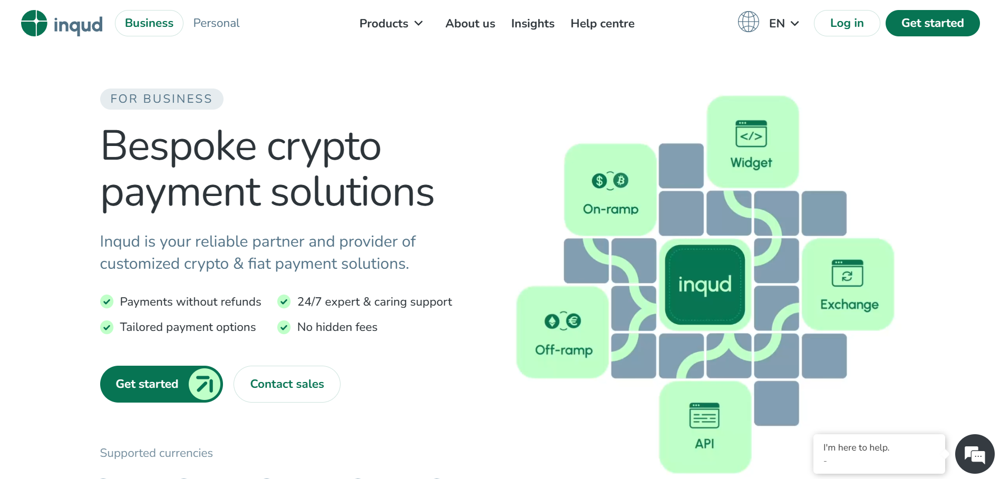
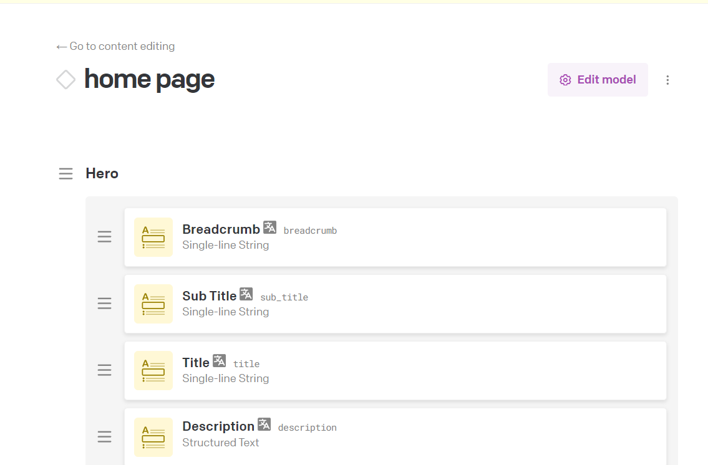
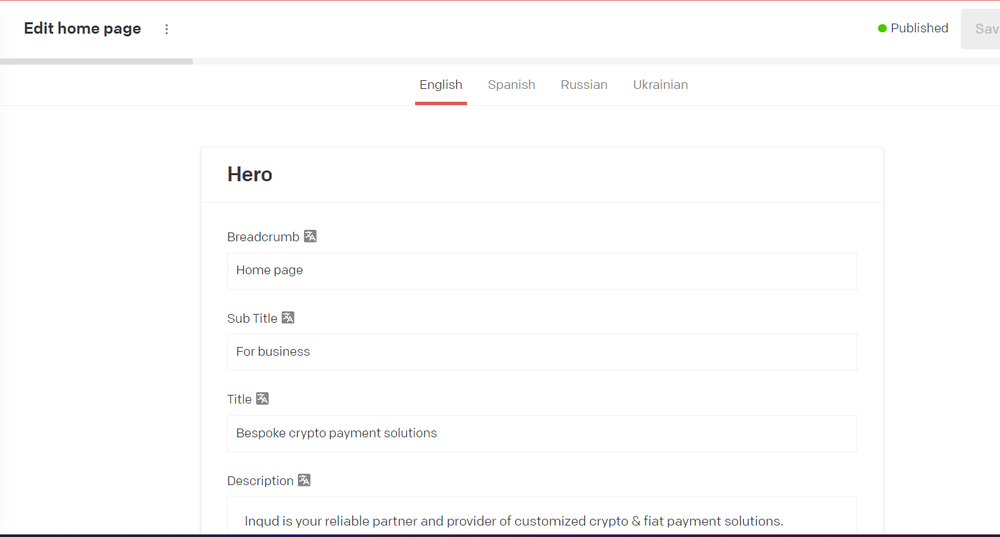
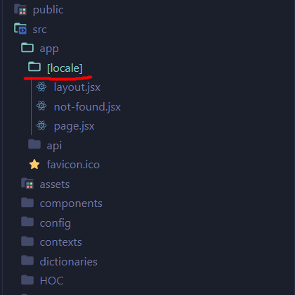
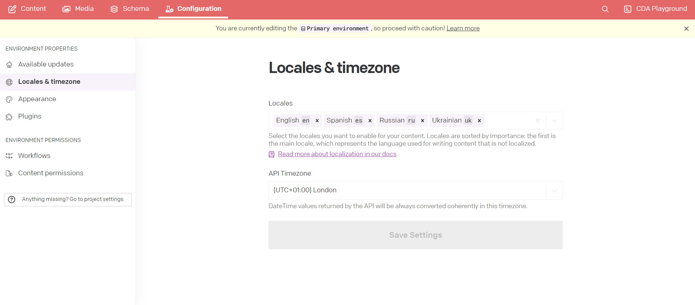

# Inqud Website: Sample Next js project

## Description

The goal was to develop a marketing seo optimized website for a company that provides services in the field of crypto and fiat payments. The company can independently change the entire site content for two languages without the participation of developers since all information on the site is displayed through the CMS. The site also has integration with support chat, Calendly, and the client’s CRM system.

## Technology Stack

- @mui/material: React component library that allows for quick and convenient development of stylish user interfaces.
- next-intl: Next.js plugin providing internationalization support for your website.
- next: React framework for building high-performance web applications.
- react-datocms: Library for interacting with DatoCMS, the leading headless CMS (Content Management System).
- react-hook-form: Library for working with forms in React using hooks.

## Examples of works

- [Integration Datocms](#integration-datocms) 
- [Integration Localization](#integration-localization)

## #Integration Datocms

DatoCMS is a web-based content management system (CMS) that focuses on providing convenient tools for creating and managing content for websites and web applications. It prioritizes developers by offering a powerful API and integration tools while also providing a user-friendly interface for content editors. With flexible content types, templates, and fields, DatoCMS allows for customization to suit various project needs. Additionally, its emphasis on speed and productivity ensures efficient content creation, editing, and publishing processes.

### Step 1:

Create optimizing calls to DatoCMS:

```
export async function performRequest({
  query,
  variables = {},
  includeDrafts = false,
  excludeInvalid = false,
  visualEditingBaseUrl,
  revalidate = 360,
}) {
  const { data } = await dedupedFetch(
    JSON.stringify({
      method: 'POST',
      headers: {
        Authorization: `Bearer ${process.env.NEXT_PUBLIC_DATOCMS_API_TOKEN}`,
        ...(includeDrafts ? { 'X-Include-Drafts': 'true' } : {}),
        ...(excludeInvalid ? { 'X-Exclude-Invalid': 'true' } : {}),
        ...(visualEditingBaseUrl
          ? {
              'X-Visual-Editing': 'vercel-v1',
              'X-Base-Editing-Url': visualEditingBaseUrl,
            }
          : {}),
        ...(process.env.NEXT_DATOCMS_ENVIRONMENT
          ? { 'X-Environment': process.env.NEXT_DATOCMS_ENVIRONMENT }
          : {}),
      },
      body: JSON.stringify({ query, variables, revalidate }),
      next: { revalidate },
    })
  )
  return data
}
```

We'll then use this function in all of our components that need to fetch content from DatoCMS.

### Step 2

Create model and set content in Datocms



### Step 3

Add content to modal



### Step 4 

Create query

```
export const HOME_PAGE_QUERY = `
query MyQuery($locale: SiteLocale) {
  homePage(locale: $locale) {
    buttonScreen1ContactSales
    buttonScreen1GetStarted
    description {
      value
    }
    features
    id
    subTitle
    title
    buttonScreen2
  }
}
`
```

### Step 5

Get Data

```
export default async function HeroSection({ params }) {
  const { homePage: data } = await getData(HOME_PAGE_QUERY, {
    locale: params.locale,
  })

  return (
    <section className={styles.wrapper}>
      <div className={clsx(styles.container, 'container')}>
        <div className={styles.leftSide}>
          <AnimatedMobile />

          <StyledTypographyIBMH5 className={styles.subTitle}>
            {data.subTitle}
          </StyledTypographyIBMH5>
          <StyledTypographyUrbanistH1 className={styles.title}>
            {data.title}
          </StyledTypographyUrbanistH1>
          <StyledTypographyUrbanistH5
            component='div'
            className={styles.paragraph}
          >
            <StructuredText data={data.description} />
          </StyledTypographyUrbanistH5>

          <ul className={styles.features}>
            {data.features.map((text) => (
              <li key={text}>
                <Image src={Check} alt='check' />
                <StyledTypographyUrbanistBody
                  className={styles['features-title']}
                >
                  {text}
                </StyledTypographyUrbanistBody>
              </li>
            ))}
          </ul>

          <div className={styles.buttonsWrapper}>
            <Link target='_blank' href='https://cabinet.inqud.com/#/signup'>
              <ButtonGetStarted className={styles.getStarted}>
                {data.buttonScreen1GetStarted}
              </ButtonGetStarted>
            </Link>

            <HeroSectionModal data={data} />
          </div>

          <HeroSectionPaymentList params={params} />
        </div>

        <div className={styles.rightSide}>
          <Device device={TABLET_OR_DESKTOP}>
            <DynamicAnimatedFirstScreenVideo
              className={styles.graphic}
              height={595}
              timeRepeat={5000}
              urlFirstVideo='/video/video1.webm'
              urlSecondVideo='/video/video2.mp4'
              width={595}
            />
          </Device>
        </div>
      </div>
    </section>
  )
}
```

## #Integration Localization

### Step 1

Install next-intl:

```
yarn add next-intl
```

### Step 2

Add middleware.js, i18n.js and layout.jsx configuration

middleware.js:

```
import createMiddleware from 'next-intl/middleware'

export default createMiddleware({
  locales: ['en', 'ru'],
  // locales: ['en', 'uk', 'es', 'ru'],

  defaultLocale: 'en',
  localePrefix: 'always',
})

export const config = {
  matcher: ['/((?!api|_next|.*\\..*).*)'],
}
```

i18n.js:

```
import { getRequestConfig } from 'next-intl/server'

export default getRequestConfig(async ({ locale }) => ({
  messages: (await import(`./src/dictionaries/${locale}.json`)).default,
}))
```

app/layout.jsx:

```
export default async function RootLayout({ children, params: { locale } }) {
  let messages
  try {
    messages = (await import(`../../dictionaries/${locale}.json`)).default
  } catch (error) {
    notFound()
  }

  return (
    <html lang={locale}>
      {/* <head>
        <link
          rel='stylesheet'
          href='https://cdn.jsdelivr.net/npm/swiper@10/swiper-bundle.min.css'
        />
        <link
          href='
https://cdn.jsdelivr.net/npm/react-toastify@9.1.3/dist/ReactToastify.min.css
'
          rel='stylesheet'
        />
      </head> */}

      <body className={nunito.className}>
        {/* <Script
          src='https://cdnjs.cloudflare.com/ajax/libs/axios/1.5.1/axios.min.js'
          integrity='sha512-emSwuKiMyYedRwflbZB2ghzX8Cw8fmNVgZ6yQNNXXagFzFOaQmbvQ1vmDkddHjm5AITcBIZfC7k4ShQSjgPAmQ=='
          crossOrigin='anonymous'
          referrerPolicy='no-referrer'
        /> */}
        {/* <Script strategy='afterInteractive' id='google-analytics'>
          {` 
           (function(w,d,s,l,i){w[l]=w[l]||[];w[l].push({'gtm.start': 
             new Date().getTime(),event:'gtm.js'});var f=d.getElementsByTagName(s)[0], 
             j=d.createElement(s),dl=l!='dataLayer'?'&l='+l:'';j.async=true;j.src= 
             'https://www.googletagmanager.com/gtm.js?id='+i+dl;f.parentNode.insertBefore(j,f); 
           })(window,document,'script','dataLayer','GTM-5J4TMBX'); 
         `}
        </Script>
        <noscript>
          <iframe
            title='googletagmanager'
            src='https://www.googletagmanager.com/ns.html?id=GTM-5J4TMBX'
            height='0'
            width='0'
            style={{ display: 'none', visibility: 'hidden' }}
          />
        </noscript> */}
        <NextIntlClientProvider locale={locale} messages={messages}>
          <LayoutComponent>{children}</LayoutComponent>
          {/* {children} */}
          <div id='myportal' />
          <div id='calendly-model-wrapper' />
        </NextIntlClientProvider>
      </body>
    </html>
  )
}
```

### Step 3

Change file structure



### Step 4

Use localization content from json file

```
const yourNeedsSectionTrans = {
  t: useTranslations('home_page_your_needs_section'),
  tList: useTranslations('home_page_your_needs_section_list_item_title'),
  tList2: useTranslations(
    'home_page_your_needs_section_list_item_description'
  ),
  cartDescription: useTranslations(
    'home_page_your_needs_section_list_item_description'
  )(keysForLocale.keys3[1]),
  cartTitle: useTranslations(
    'home_page_your_needs_section_list_item_description'
  )(keysForLocale.keys3[0]),
}
const yourNeedsSectionTransCart = {
  cartDescription: useTranslations(
    'home_page_your_needs_section_list_item_description'
  )(keysForLocale.keys3[1]),
  cartTitle: useTranslations(
    'home_page_your_needs_section_list_item_description'
  )(keysForLocale.keys3[0]),
}
const cryptoWidgetTrans = {
  t: useTranslations('home_page_crypto_widget_section'),
}
const blogTrans = {
  t: useTranslations('blog_name_section'),
}
```

### Step 5

Use localization content from Datocms.
Add locales to Datocms



### Step 6

Get localization content from Datocms

```
const { homePage: data } = await getData(HOME_B2B_CRYPTO_WIDGET, {
  locale: params.locale,
})
```